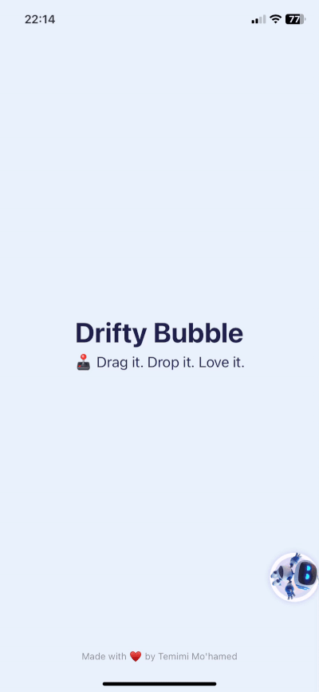

# 🫧 DriftyBubble

**DriftyBubble** is a playful SwiftUI demo that showcases a draggable, floating action bubble — inspired by Siri or Messenger-style buttons. It stays on top of your app’s content and can be moved freely by the user.

Perfect as a foundation for in-app assistants, voice triggers, accessibility tools, or just a fun UI element that brings delight to your interface.

> 🎈 *DriftyBubble – Tap. Drag. Float.*

---

## ✨ Features

- 🫧 **Always-on-top Bubble UI** — floats freely above all views.
- 🎯 **Draggable Anywhere** — let your users place it wherever they like.
- 💥 **Smooth Animations** — satisfying bounce and drag effects.
- 🎨 **Easily Customizable** — change size, icon, color, and behavior.
- 🔍 **Clean, Pure SwiftUI Code** — perfect for learning or adapting to your own needs.

---

## 📸 Preview

🕹️ Drag it. Drop it. Love it.

_(If you're viewing this on GitHub, you can check the `Ressources/preview.gif` in the repo for a quick look.)_

---

## 📂 How to Use

1. Clone or download this repository:

https://github.com/med-temimi/DriftyBubble

2. Open the project in Xcode.

3. Run the demo on a simulator or device.

4. Explore the `AlternatingRotatingImage.swift` and  `DriftyBubble.swift` to see how it works.

---

## 🛠 Customize It

You can easily tweak:
- The icon (`Image(systemName: ...)`)
- Size and shape of the bubble
- Tap action behavior
- Edge snapping logic (Already implemented)
- Visual styling like shadows or borders

Make it yours!

---

## 🤓 Who is this for?

This project is perfect if you:
- Want to add a floating action button to your SwiftUI app
- Are curious how to layer views above everything else
- Love experimenting with fun, interactive UI

---

## 📄 License

This project is released under the [MIT License](LICENSE).  
Feel free to use it, remix it, and make your app a little bubblier 🫧

---

## 🌟 Like it?

Drop a ⭐️ if this project made you smile or taught you something new!

---

